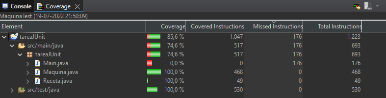
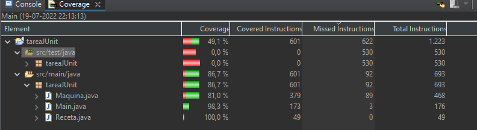

# Projecto de Testing con Java, Maven y JUnit INF-331
Tarea de INF331 la cual consta de un proyecto en Java con sus respectivas pruebas unitarias y coverage respectivo de las mismas
## Instalación
Se requiere ejecutar este proyecto en un IDE Eclipse, idealmente en Windows con versión `2022-06 (4.24.0)` o superior
## Como usar
Se debe instalar el proyecto de Maven con `maven-install` por medio de Eclipse.
Ejecutar el archivo `main.java` para utilizar la aplicación.
## Resultados de Coverage
### Coverage por test unitarios
Coverage por test unitarios tuvo un 100% tanto para la clase `Maquina` como la clase `Receta` por medio de test hacia `Maquina` ya que esta usa la otra respectivamente.  
  
Para probar el funcionamiento del Main e interacción con input de usuario se hizo de manera manual debido a falta de tiempo y conocimiento de como emular inputs y outputs por medio de testing. A continuación se presenta un 98% de coverage en el Main, del cual solo `class Main` no pudo ser testeado de manera manual.  
  
[Archivo con test manual de inputs utilizado](./coverage/manualTest.md)

## Cómo contribuir
- Crea tu _fork_ directamente.
- Sigue el procedimiento clásico: crea tu _branch_, confirma tus cambios por medio de _commits_ y realiza _push_ a tu _branch_.
- Envía un _pull request_ con los cambios realizados.

## Licencia
The MIT License (MIT)  
Copyright (c) 2022 Raúl Álvarez Cortés
